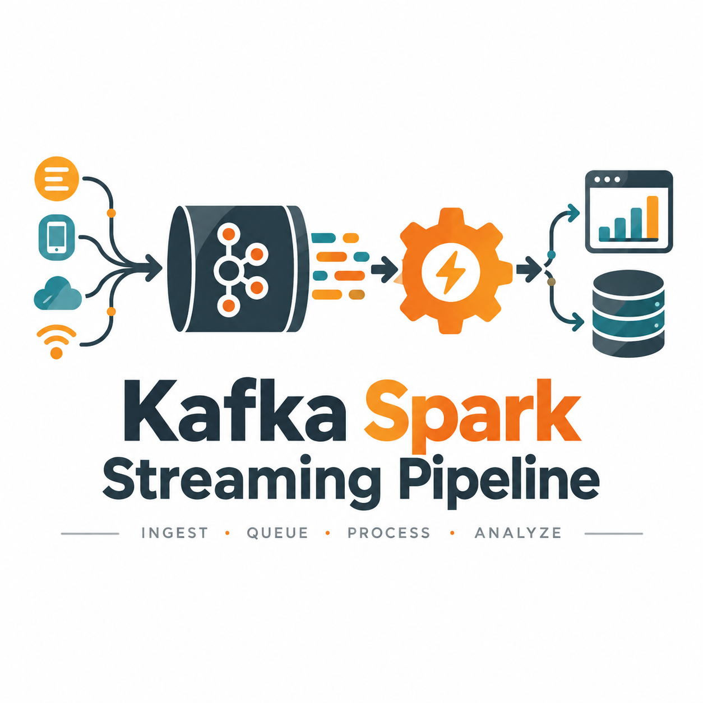

<p align="center">
  
</p>

<h1 align="center">Kafka Spark Streaming Pipeline</h1>

<p align="center">Ingest, queue, process, and serve article data through a streaming architecture.</p>

<p align="center">
  <a href="#offline-demo">Offline demo</a> ·
  <a href="#live-stack">Live stack</a> ·
  <a href="#architecture">Architecture</a>
</p>

This project prototypes a data pipeline for turning scraped market articles into structured content:

```text
Airflow → Playwright/OpenAI → Kafka → Spark Structured Streaming → Cassandra → Streamlit
```

The repository includes a dependency-free demo for the data contract and a Docker-based stack for experimenting with the full topology.

## Start with the offline demo

The demo uses only the Python standard library. It models scrape-shaped input, duplicate removal, JSONL storage output, and a small HTML preview:

```bash
python demo.py
open demo-output/index.html
```

Expected output:

```text
Normalized 2 articles from 3 input messages.
JSONL: demo-output/blog_posts.jsonl
Preview: demo-output/index.html
```

This is intentionally local and deterministic; it does not pretend to run Kafka or Spark.

## Why use it?

- **See the data contract first.** Article messages are normalized before storage.
- **Make deduplication explicit.** The demo removes repeated article URLs before writing JSONL.
- **Keep the full topology visible.** The Docker stack shows where scheduling, queueing, processing, storage, and viewing belong.
- **Swap the source without rewriting the sink.** Scraper selectors and provider logic live separately from the streaming and storage code.

## Live stack

The full experiment uses Kafka, Spark, Cassandra, Airflow, and Streamlit. It requires Docker and an OpenAI API key for the enrichment path.

```bash
cp .env.example .env
# Set OPENAI_API_KEY in .env
docker compose up -d
```

When the services are healthy:

| Service | Local URL |
| --- | --- |
| Airflow | `http://localhost:8080` |
| Streamlit | `http://localhost:8501` |
| Kafka Control Center | `http://localhost:9021` |
| Spark master UI | `http://localhost:9090` |

The live scraper depends on the selectors in `dags/utils/scrapping.py` and on the availability of the upstream website. It is an experimental integration, not a guaranteed public data feed.

## What is included?

| Stage | Implementation |
| --- | --- |
| Scheduling | Airflow DAG in `dags/playwright_stream.py` |
| Ingestion | Playwright scraper and article enrichment |
| Queue | Kafka topic `blog_posts` |
| Processing | Spark Structured Streaming in `spark_stream.py` |
| Storage | Cassandra table `spark_streams.blog_posts` |
| Viewer | Streamlit reader in `streamlit_app.py` |

## Architecture

```text
Website → Playwright scraper → Kafka: blog_posts
                                  ↓
                   Spark Structured Streaming
                                  ↓
                         Cassandra storage
                                  ↓
                            Streamlit viewer
```

## Extend the pipeline

- Update source selectors in `dags/utils/scrapping.py` when a provider changes its page structure.
- Keep the Kafka message fields compatible with the `title`, `content`, and `image` schema in `spark_stream.py`.
- Use `demo.py` after changing the message shape before starting the full Docker stack.

Keep `.env` and API keys local. The pipeline is for data-engineering experimentation and does not provide investment advice.
